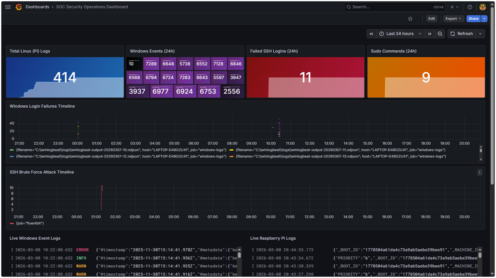
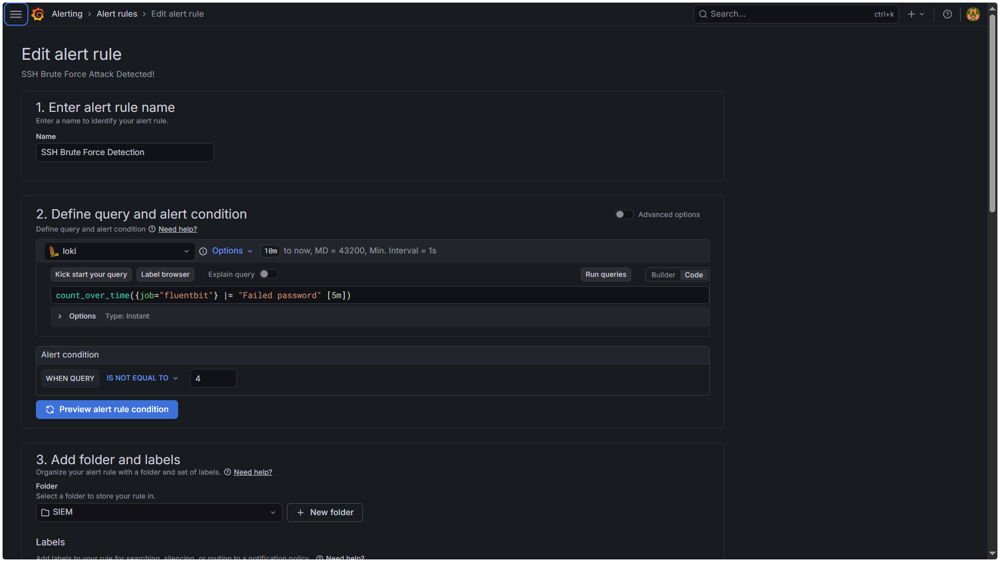
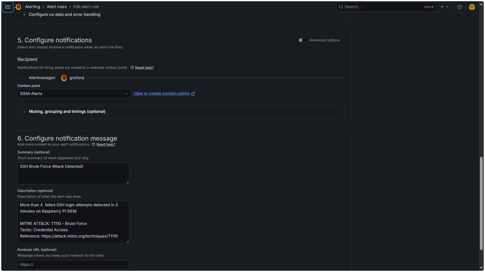
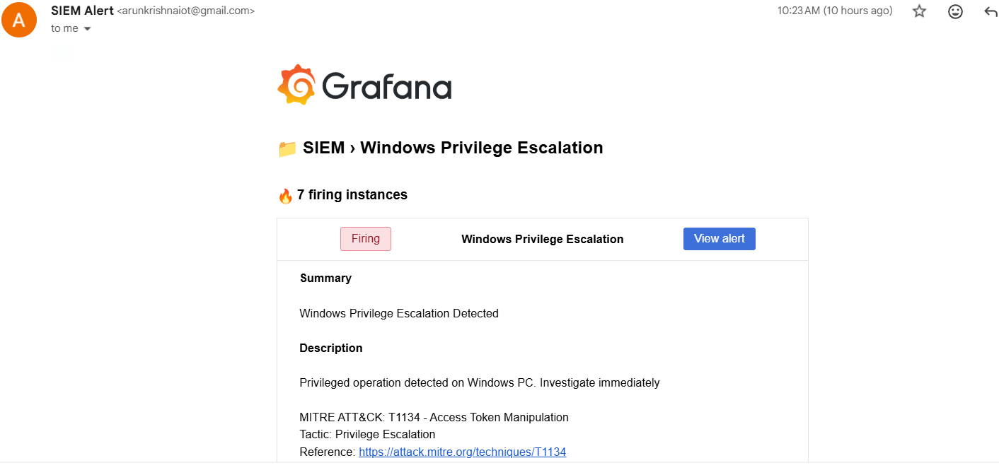
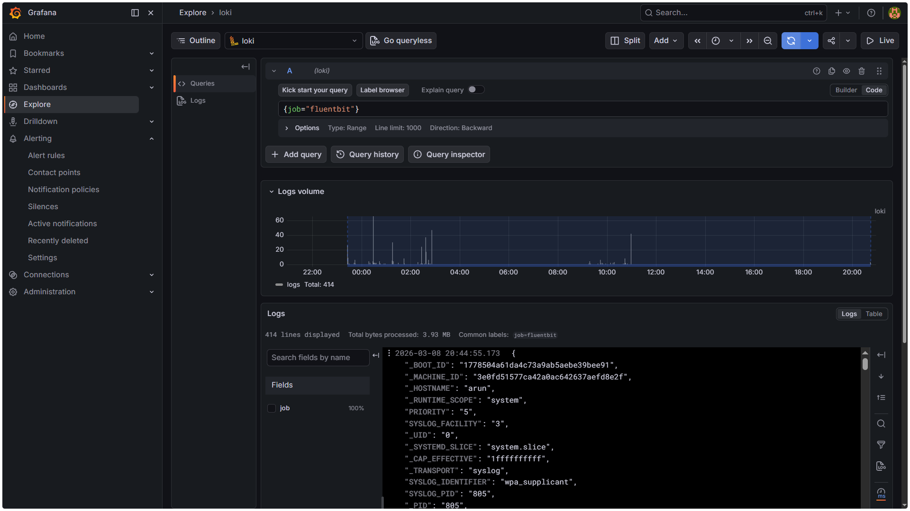
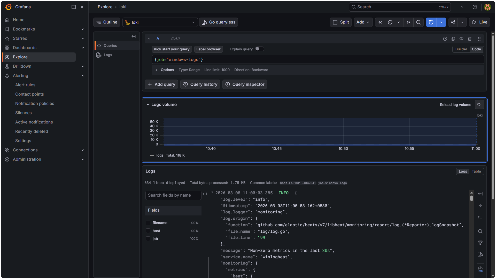

# 🔐 Lightweight SIEM & Log Monitoring System

> Hands-on Blue Team project: Building a lightweight SIEM on Raspberry Pi 4 for real-time security monitoring of Linux and Windows devices.



---

## 👨‍💻 Author
**Arun Krishna B V**
- SOC Analyst | IoT + Blue Team
- 📧 arunkrishnaiot@gmail.com

---

## 📋 Table of Contents
- [Overview](#overview)
- [Architecture](#architecture)
- [Tech Stack](#tech-stack)
- [Features](#features)
- [Detection Rules](#detection-rules)
- [MITRE ATT&CK Mapping](#mitre-attck-mapping)
- [Installation](#installation)
- [Screenshots](#screenshots)

---

## 🎯 Overview

This project implements a lightweight SIEM platform using Raspberry Pi 4 as the central monitoring server. It collects, stores, and analyzes security logs from multiple devices in real time with automated threat detection and professional email alerting.

---

## 🏗️ Architecture
```
Windows PC (192.168.0.8)
  └── Winlogbeat  → reads Windows Event logs
  └── Promtail    → ships logs to Pi
         │
         ▼
Raspberry Pi (192.168.0.6)
  └── Fluent Bit  → reads Pi system logs
  └── Loki        → stores all logs
  └── Grafana     → dashboard + alerts
         │
         ▼
    📧 Email Alerts!
```

---

## 🛠️ Tech Stack

| Component | Tool | Version | Purpose |
|---|---|---|---|
| Log Collection (Pi) | Fluent Bit | v4.2.3 | Linux log collection |
| Log Collection (Win) | Winlogbeat | v9.3.1 | Windows event logs |
| Log Forwarding | Promtail | v3.6.7 | Ship logs to Loki |
| Log Storage | Grafana Loki | v2.9.0 | Centralized storage |
| Visualization | Grafana | Latest | Dashboard + Alerts |
| Containerization | Docker + Compose V2 | - | Service management |
| Alerts | Gmail SMTP | - | Email notifications |
| Win Service | NSSM | v2.24 | Auto-start Promtail |

---

## ✨ Features

- ✅ Centralized log aggregation (Pi + Windows)
- ✅ Real-time Grafana dashboard (10 panels)
- ✅ 7 detection rules with MITRE ATT&CK mapping
- ✅ Professional email alerting via Gmail SMTP
- ✅ Persistent Docker volumes
- ✅ Auto-start on boot (Pi + Windows)
- ✅ Static IP configuration
- ✅ Multi-device security monitoring

---

## 🚨 Detection Rules

| Rule | Source | Query | Threshold |
|---|---|---|---|
| SSH Brute Force | Pi | Failed password | >5 in 5min |
| Sudo Abuse | Pi | sudo | >10 in 5min |
| New User Created | Pi | new user | >0 in 5min |
| System Reboot | Pi | reboot | >0 in 5min |
| Windows Brute Force | Windows | failure | >5 in 5min |
| New User (Windows) | Windows | new user | >0 in 5min |
| Windows Priv Escalation | Windows | privileged | >0 in 5min |

---

## 🎯 MITRE ATT&CK Mapping

| Rule | MITRE ID | Technique | Tactic |
|---|---|---|---|
| SSH Brute Force | T1110 | Brute Force | Credential Access |
| Sudo Abuse | T1548 | Abuse Elevation Control | Privilege Escalation |
| New User Created | T1136.001 | Create Local Account | Persistence |
| System Reboot | T1529 | System Shutdown/Reboot | Impact |
| Win Brute Force | T1110.001 | Password Guessing | Credential Access |
| Win New User | T1136.001 | Create Local Account | Persistence |
| Win Priv Esc | T1134 | Access Token Manipulation | Privilege Escalation |

---

## 🔧 Installation

### Prerequisites
- Raspberry Pi 4 (4GB RAM minimum)
- 64GB SD Card
- Windows 10/11 PC
- Both devices on same network

### Step 1 — Raspberry Pi Setup
```bash
# Update system
sudo apt update && sudo apt upgrade -y

# Install Docker
curl -fsSL https://get.docker.com | sh
sudo usermod -aG docker $USER

# Clone this repo
git clone https://github.com/arunkrishna/raspberry-pi-siem
cd raspberry-pi-siem

# Start SIEM services
docker compose up -d

# Install Fluent Bit
sudo apt install fluent-bit -y
sudo cp configs/pi/fluent-bit.conf /etc/fluent-bit/
sudo systemctl enable fluent-bit
sudo systemctl start fluent-bit
```

### Step 2 — Set Static IP on Pi
```bash
sudo nano /etc/dhcpcd.conf
```

Add at bottom:
```
interface wlan0
static ip_address=192.168.0.6/24
static routers=192.168.0.1
static domain_name_servers=8.8.8.8
```

### Step 3 — Configure Grafana

1. Open http://PI_IP:3000
2. Login: admin/admin
3. Add Loki datasource: http://loki:3100
4. Import detection rules
5. Configure SMTP in docker-compose.yml

### Step 4 — Windows Setup
```powershell
# Install Winlogbeat
cd C:\winlogbeat
copy configs\windows\winlogbeat.yml .
.\install-service-winlogbeat.ps1
Set-Service -Name winlogbeat -StartupType Automatic
Start-Service winlogbeat

# Install Promtail
cd C:\promtail
copy configs\windows\promtail-config.yml .
.\nssm.exe install Promtail-SIEM "C:\promtail\promtail-windows-amd64.exe" "--config.file=C:\promtail\promtail-config.yml"
.\nssm.exe set Promtail-SIEM Start SERVICE_AUTO_START
Start-Service Promtail-SIEM
```

---
## 📸 Screenshots

### SOC Dashboard


### Alert Rules



### Email Alert


### Live Logs



---

## 📁 Project Structure
```
raspberry-pi-siem/
├── README.md
├── configs/
│   ├── pi/
│   │   ├── docker-compose.yml
│   │   └── fluent-bit.conf
│   └── windows/
│       ├── winlogbeat.yml
│       └── promtail-config.yml
├── screenshots/
│   ├── dashboard.png
│   ├── alert-rules.png
│   ├── email-alert.png
│   └── loki-logs.png
└── docs/
    └── SIEM_Documentation.pdf
```

---

## 🔗 References

- [Grafana Loki Documentation](https://grafana.com/docs/loki)
- [Fluent Bit Documentation](https://docs.fluentbit.io)
- [MITRE ATT&CK Framework](https://attack.mitre.org)
- [Winlogbeat Documentation](https://www.elastic.co/beats/winlogbeat)

---

## 📄 License
MIT License — feel free to use and modify!